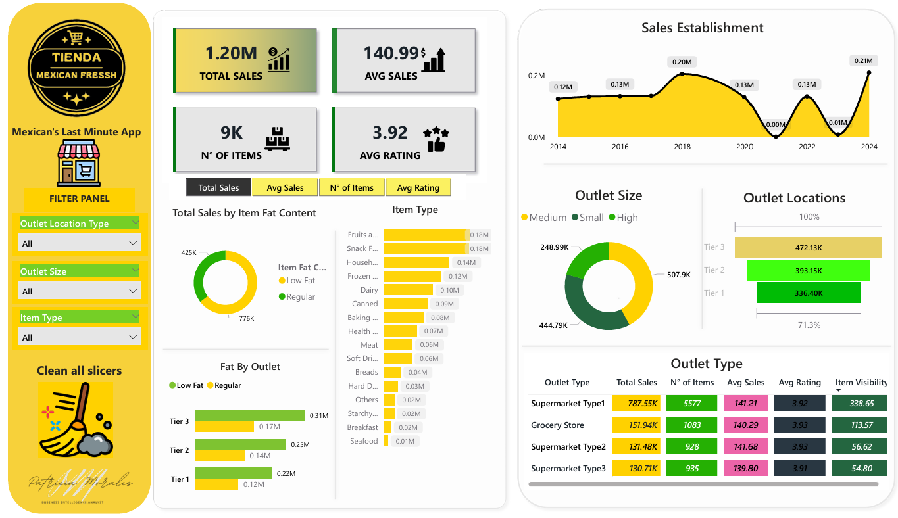

# 🛒 Real-Time Sales Dashboard – Mexican’s Last Minute App

📌 **Project Summary**  
An interactive Power BI dashboard that analyzes retail sales across Mexico, simulating a real-time business intelligence tool for decision-making in the food retail sector.

📊 **Project:** Real-Time Sales Dashboard for Mexican’s Last Minute App  
🧰 **Tools:** Power BI Desktop, DAX, Data Modeling  
📁 **Dataset:** Simulated sales data of retail stores and product categories in Mexico  
📅 **Date:** June 2025

---

🎯 **The Business Challenge (Little Storytelling)**  
_"Mexican’s Last Minute App"_ helps retail managers react quickly to market trends. The challenge? Understand how different outlet types, sizes, and product categories contribute to sales. This dashboard simulates a real-time monitoring system to answer key questions:  
- Which product types generate the most revenue?  
- Do low-fat items really drive customer behavior?  
- What outlet size or tier brings in the highest returns?

By breaking down performance metrics like total sales, number of items, average sales, and ratings, this dashboard empowers businesses to make data-driven stocking and marketing decisions.

---

🖼️ **Dashboard Preview**  

---
🛠️ **End-to-End Development Workflow**
1. **Data Cleaning & Modeling:** Structured raw data using Power BI's Power Query and relationships.
2. **Metric Calculation:** Created KPIs like Total Sales, Avg Sales, and Avg Rating using DAX.
3. **Visual Design:** Organized insights with filters by outlet type, fat content, and item category.
4. **Interactivity:** Enabled dynamic filtering for real-time decision-making simulation.
---

🌍 **Key Insights**
- 🥗 **Low Fat items** lead sales with over 776K, signaling strong preference for health-conscious products.
- 🛒 **Supermarket Type 1** dominates with over 787K in revenue and highest item count.
- 📍 **Tier 3 locations** surprisingly outperform Tier 1 and 2 in total sales.
- 🧃 **Fruits and Snacks** are top-selling categories, essential for inventory focus.
- 🏬 **Medium-sized outlets** show optimal sales performance across metrics.

---
🧠 **What I Learned**
- Hands-on DAX practice for real-time KPI calculations.
- Importance of user-focused filter panels in dashboard usability.
- Gained experience simulating business needs through fictional app-based analytics.
- Developed an eye for visual clarity and data storytelling within Power BI.
